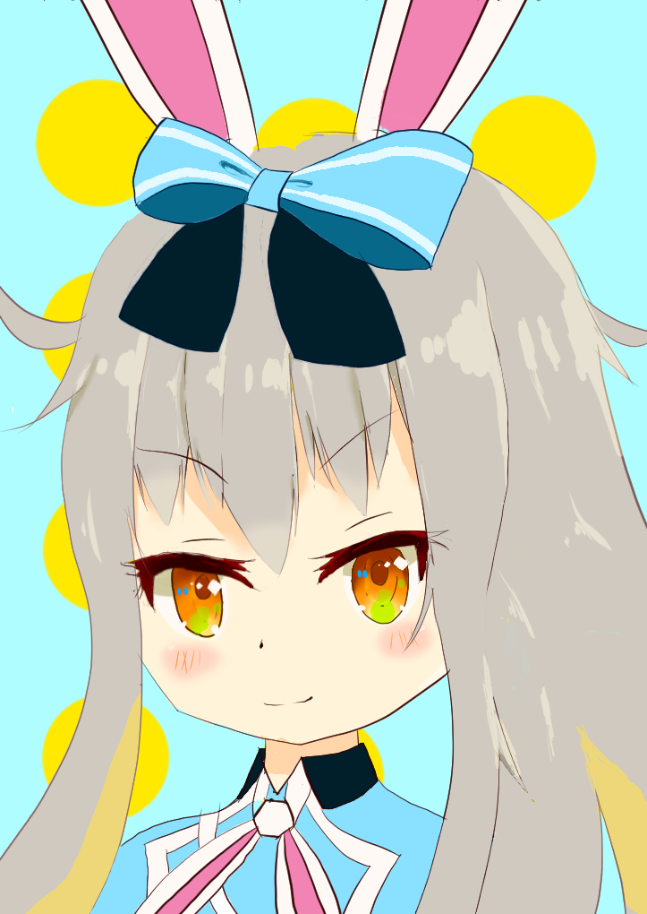
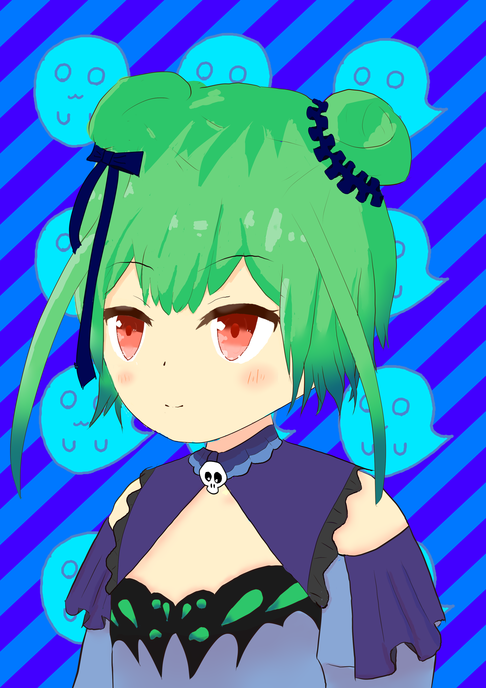

東方にはまったあたりからアニメ調のイラストをよく見るようになり、自分でも描いてみたいと思い描いている。

(さいとうなおき)[https://www.youtube.com/channel/UCxuipVSw8ajLZPgSyKmw6Ag]さん、(ディープブリザード)[https://www.youtube.com/channel/UCHXgFLFyqR-XqtxfTH3qiYA]さんの動画などを参考にイラストを描いている。


# Works

- 2020/11/17 (餅月ひまり)[https://www.youtube.com/channel/UCnZUaScptUZ7vBeV-4Vf4nw]


```
大きさはA8。
頭の形は球に五角形の仮面をかぶせるイメージで。
髪の上の方は頭頂の球形に沿わせ、切れ目は2/5程度入れる。
生え際からの流れを髪の一房ごとにイメージ。
髪の線を細くすることで立体感を出す。
瞳孔奥のグラデーションとハイライト・映り込みを重ねることで立体感を出す。

輪郭がちょっと流れてしまったこと、目・後頭部の想定している角度にズレがあることが不満点。
```

- 2020/11/02 (潤羽るしあ)[https://www.youtube.com/channel/UCl_gCybOJRIgOXw6Qb4qJzQ]

