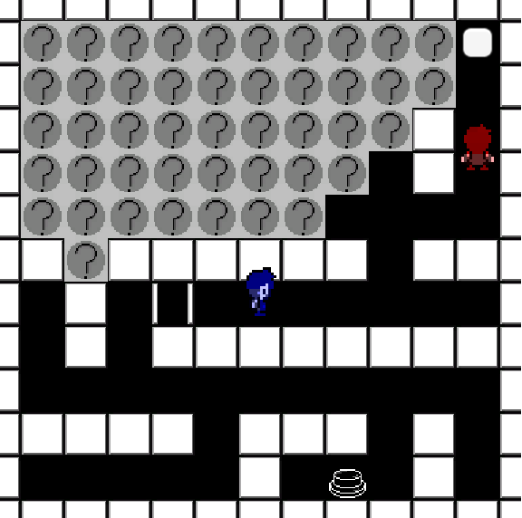
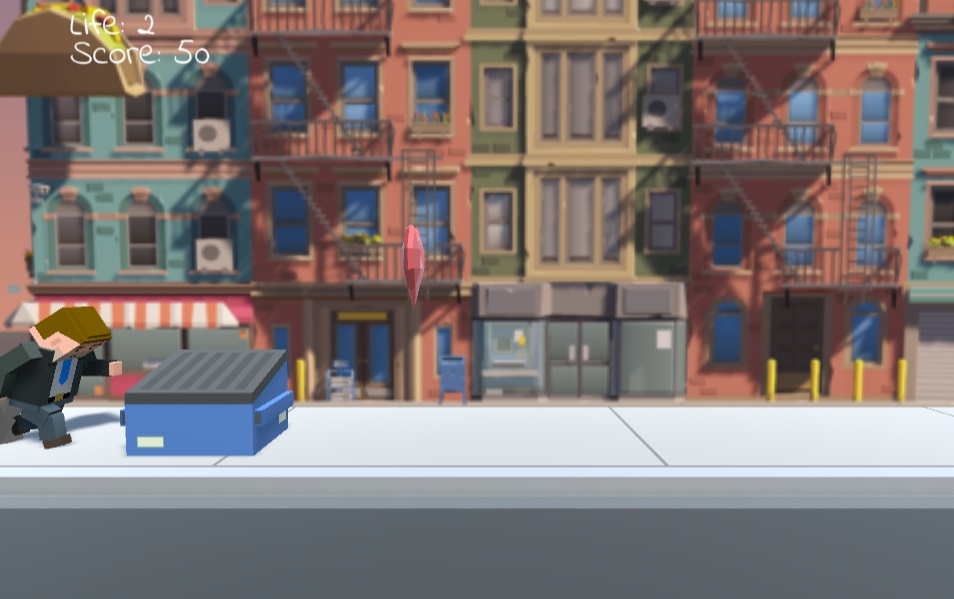

# About
VR・ゲームプログラマー見習い。まだギリギリ学生。
就活しくじったんで多分浪人します。

---

## Profile
- 名前：EXC
- 年齢：成人済
- 使用経験：C++、C#、Python、Scala、Unity
- 興味：VRとかゲームプログラミングとか
- email: draw.ngoa.way@gmail.com

## Develop Activity
### 1 Switch 1 Door

環境：Unity

制作期間：2020/12/21~12/27

[1 Switch 1 Door - EXC](https://unityroom.com/games/exc_one_switch_one_door)

キー移動で迷路を進み右上のゴールを目指す、オンライン対戦ゲーム。

Unity 1 weekという企画で作成。

### Running Worker

環境：Unity

制作期間：2020/12/10~12/20

[Running Worker - EXC](https://unityroom.com/games/exc_create_with_code)

スペースキーでジャンプするだけのジャンプゲーム。

### SCP-TCG-JP-J再現

言語：Scala

期間：2020/11(中断)

[https://github.com/Exc-yujin/SCPTcgLib](https://github.com/Exc-yujin/SCPTcgLib)

[購買部版SCP-TCG-JP-J](https://gamerch.com/scp-tcg-jp-pd/)というカードゲームの再現をするScalaプロジェクト。
